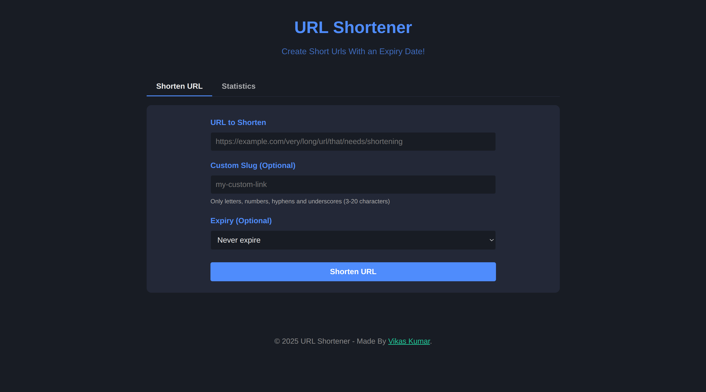
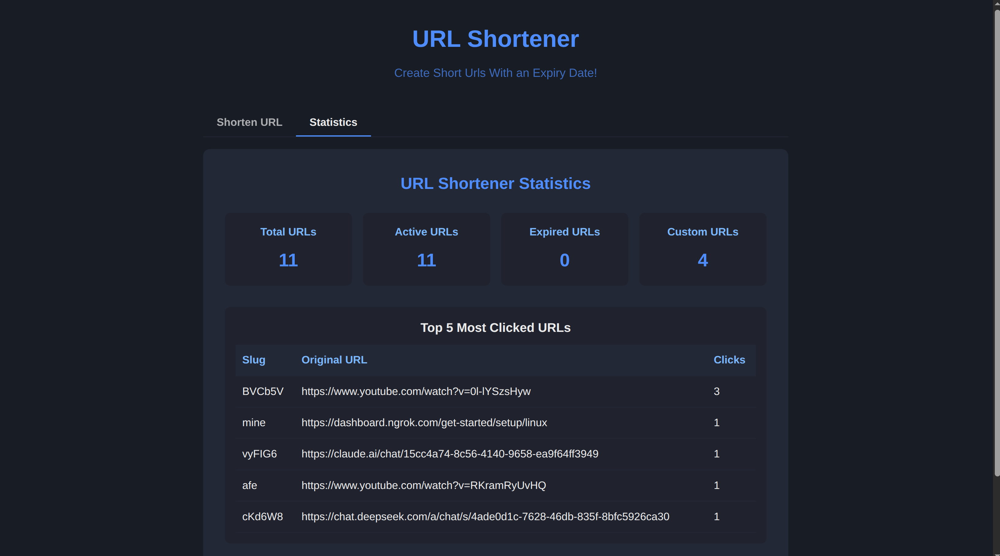

# URL Shortener - MERN Stack Application

A complete URL shortening service built with the MERN stack (MongoDB, Express.js, React, Node.js).

**Live demo: [url-shortener-8p4v.onrender.com](https://url-shortener-8p4v.onrender.com/)**
*(hosted on Render's free tier — spins down after 15 min idle, so the first load after a while can take 30-60s to wake up)*

## Screenshots 


---




## Features

- **URL Shortening**: Convert long URLs into short, easily shareable links
- **Custom Slugs**: Create personalized short links (e.g., `/my-link`)
- **Expiration Settings**: Set custom expiration dates for links
- **Statistics**: View usage stats for your shortened URLs
- **Efficient Click Analytics (Queue-based)**: Clicks are now buffered in memory and written to the database in batches, reducing write load and improving performance for high-traffic links.
- **Automatic Link Expiry Cleanup**: Expired links are automatically deleted from the database via a MongoDB TTL index — no cron job required.
- **Responsive Design**: Works on desktop and mobile

## How Click Analytics Queue Works

- When a short URL is accessed, the click is added to an in-memory queue instead of being written to the database immediately.
- Every few seconds, all queued click counts are flushed to the database in bulk.
- This approach reduces database writes and is especially beneficial for popular links.
- On shutdown (`SIGINT`/`SIGTERM`), the server flushes any remaining queued clicks before exiting.

## Tech Stack

- **Frontend**: React.js
- **Backend**: Node.js with Express.js
- **Database**: MongoDB
- **Styling**: Custom CSS

## Project Structure

```
url-shortener/
├── client/                   # Frontend React application
│   ├── public/
│   │   ├── index.html
│   │   └── favicon.ico
│   ├── src/
│   │   ├── components/       # React components
│   │   │   ├── Header.js
│   │   │   ├── Footer.js
│   │   │   ├── UrlForm.js    # Form for URL shortening
│   │   │   └── Stats.js      # Stats component
│   │   ├── App.js            # Main React application
│   │   ├── index.js          # Entry point
│   │   └── App.css           # Styles
│   └── package.json          # Frontend dependencies
│
├── server/                   # Backend Node.js/Express application
│   ├── config/
│   │   └── db.js             # MongoDB connection
│   ├── controllers/
│   │   └── urlController.js  # Controller for URL operations (includes click queue logic)
│   ├── middleware/
│   │   ├── errorHandler.js   # Error handling middleware
│   │   └── validateUrl.js    # URL validation middleware
│   ├── models/
│   │   └── Url.js            # MongoDB schema for URLs
│   ├── routes/
│   │   └── urlRoutes.js      # API routes
│   ├── utils/
│   │   └── urlEncoder.js     # Helper for encoding/generating slugs
│   ├── server.js             # Main server file
│   └── package.json          # Backend dependencies
│
└── README.md                 # Project documentation
```

## API Endpoints

| Method | Endpoint | Description |
|--------|----------|-------------|
| POST   | `/api/url/shorten` | Create a new shortened URL |
| GET    | `/:slug` | Redirect to the original URL |
| GET    | `/api/url/stats` | Get URL statistics |

## Installation & Setup

### Prerequisites

- Node.js (v14+ recommended)
- MongoDB (local or Atlas)

### Setup Instructions

1. **Clone the repository**
   ```
   git clone https://github.com/vikaskumar-23/urlShortenerProject.git
   cd url-shortener
   ```

2. **Install backend dependencies**
   ```
   cd server
   npm install
   ```

3. **Set environment variables**
   Create a `.env` file in the server directory with the following:
   ```
   MONGO_URI=mongodb://localhost:27017/urlshortenercl
   PORT=5000
   NODE_ENV=development
   ```

4. **Install frontend dependencies**
   ```
   cd ../client
   npm install
   ```

5. **Run the application**
   
   In the server directory:
   ```
   npm run dev
   ```
   
   In the client directory:
   ```
   npm start
   ```

6. **Access the application**
   Open your browser and navigate to `http://localhost:3000`

## Usage

1. Enter a long URL in the input field
2. (Optional) Add a custom slug
3. (Optional) Set an expiration date
4. Click "Shorten URL"
5. Copy and share your shortened URL!

## MongoDB Schema

The URL schema includes the following fields:

- `slug`: The short URL identifier (unique)
- `originalUrl`: The original long URL
- `createdAt`: When the URL was shortened
- `expiresAt`: When the URL will expire (null if never). Backed by a TTL index, so once this date passes MongoDB removes the document automatically.
- `clicks`: Number of times the short URL has been accessed
- `customSlug`: Whether the slug was custom-created by the user

